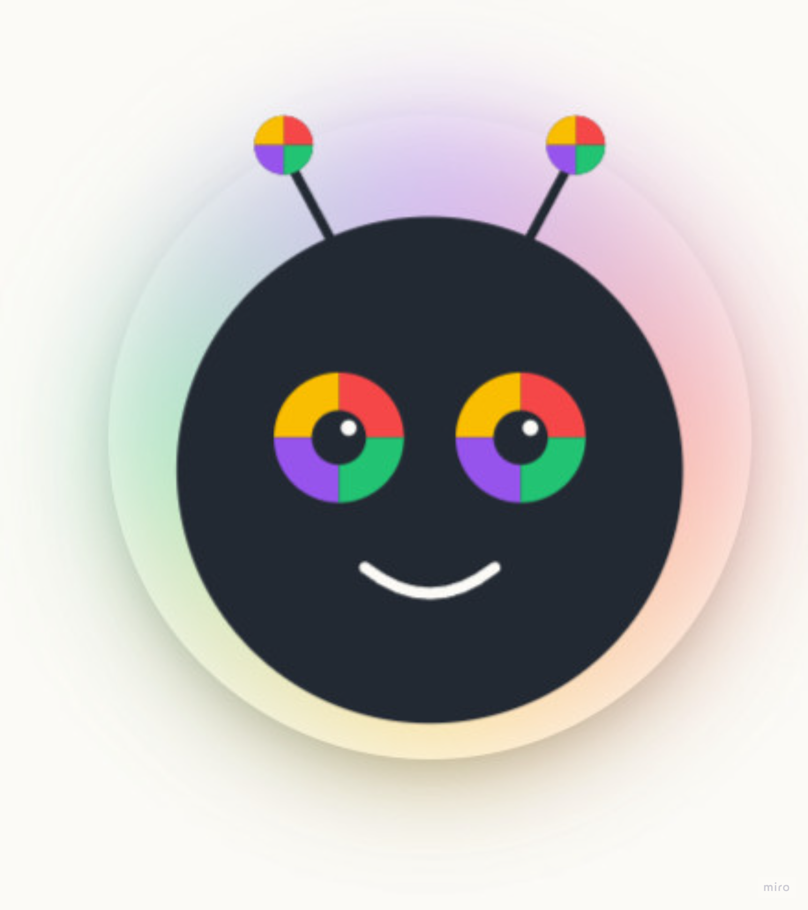

# Fluentoo

A warm, curious desktop companion that helps you practice German through daily voice conversations.

<p align="center">
  
</p>

Fluentoo lives on your desktop as a floating always-on-top window. Talk to it, type to it, get gentle corrections, and build a streak.

## Features

- **Voice-first conversation** — speak German, get a warm response back in German (STT via Web Speech API, TTS via CambAI)
- **Daily Mission** — choose from 3 short speaking prompts each day (Morgen-Check, Restaurant, Wochenende, Mini-Story)
- **Gentle evaluation** — any genuine attempt counts; corrections arrive as "Man sagt besser…"
- **Fluency Stages** — 5-stage progression (🌱 Schüchtern → 🌿 Versucht es → 🌊 Komfortabel → 🔥 Selbstbewusst → 🚀 Fluentoo Level) with XP, streak multiplier, and level-up animations
- **Emotion engine** — the avatar laughs, smiles, gets excited, or looks a bit sad based on your performance; emoji particles fly on big wins
- **45-minute reminder** — a nudge to keep the habit alive
- **Obsidian integration** — point it at your vault and your vocabulary gets folded into the tutor's context

## Tech Stack

- **Electron 31** — frameless transparent always-on-top window
- **Featherless AI** (`Qwen/Qwen2.5-72B-Instruct`) — German tutor LLM, OpenAI-compatible
- **Web Speech API** — browser-native speech recognition (primary STT)
- **CambAI** — TTS with a real German voice
- **electron-store** — persisted settings and progress
- **Vanilla HTML/CSS/JS** — no framework, all the avatar/UI built with CSS `conic-gradient` and keyframe animations

## Setup

```bash
npm install
cp .env.example .env   # add your API keys
npm start
```

Keys required:
- `FEATHERLESS_API_KEY` — for the LLM
- `CAMB_API_KEY` + `CAMB_VOICE_ID` — for TTS (optional; falls back to browser speech)
- `GROQ_API_KEY` — optional remote STT fallback

On first launch macOS will ask for microphone access.

## Brand

**Warm · Curious · Precise · Patient** — fluency is not memorised, it's inhabited.

## License

MIT
